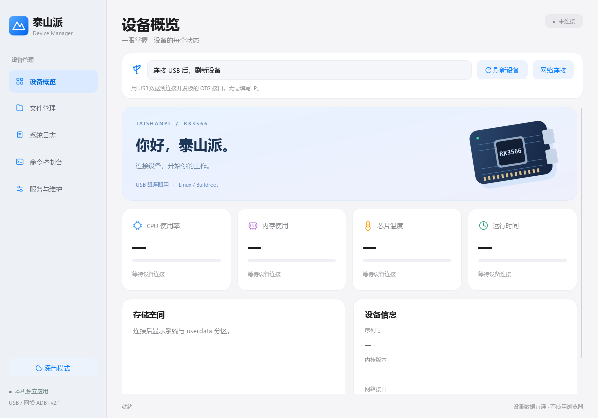
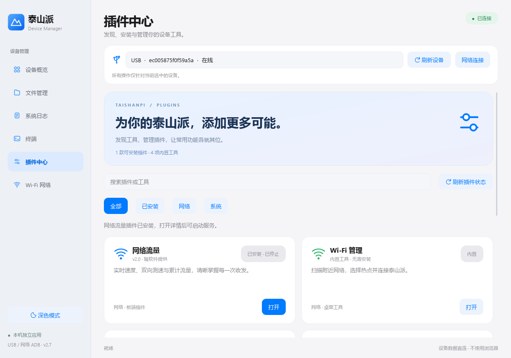
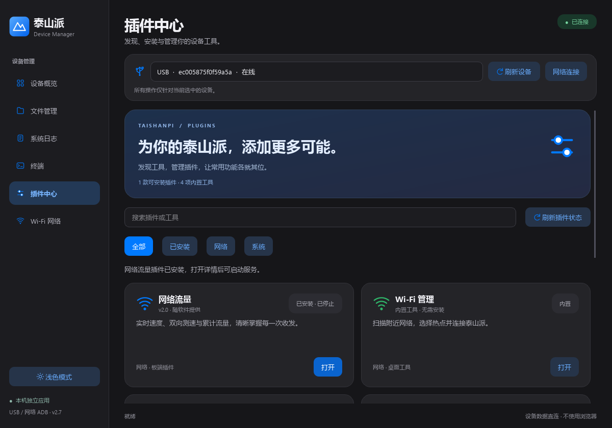
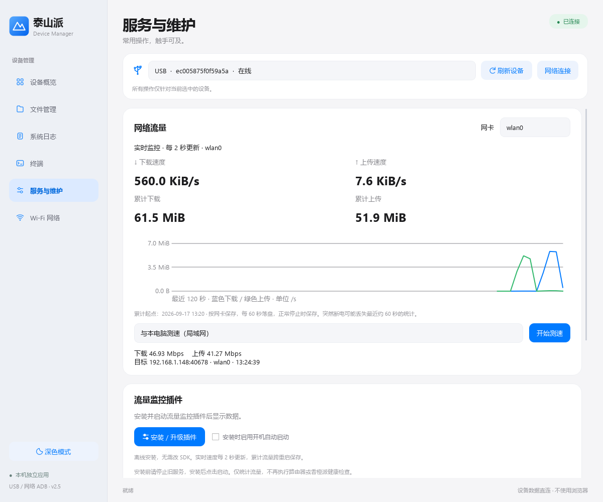
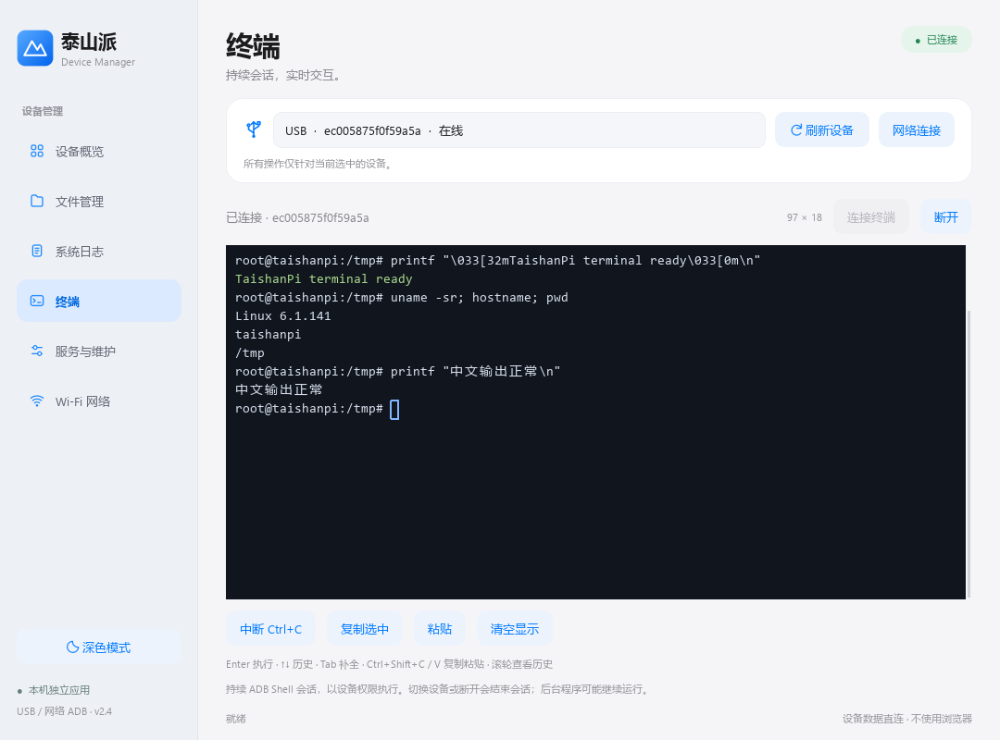

# 泰山派设备管理 · TaishanPi Manager Desktop

<p align="center">
  
</p>

<p align="center">
  面向 LCSC TaishanPi RK3566 的 Windows 原生桌面管理工具
</p>

<p align="center">
  <a href="https://gitee.com/qianmonai/TaishanPiManager-Desktop/releases"></a>
  <a href="https://gitee.com/qianmonai/TaishanPiManager-Desktop"></a>
  <a href="https://www.python.org/"></a>
  <a href="https://www.qt.io/qt-for-python"></a>
  <a href="https://gitee.com/qianmonai/TaishanPiManager-Desktop/tags"></a>
</p>

## 项目简介

泰山派设备管理是一款基于 PySide6 的 Windows 桌面应用，用于通过 USB ADB 或局域网连接、管理和调试 TaishanPi RK3566 设备。

它把设备概览、文件传输、日志查看、交互终端、网络设置和插件管理整合在一个界面中，并提供网络流量监控、测速、代理、串口、摄像头、LD06 雷达和 GPIO 等工具。

## 功能一览

| 模块 | 能做什么 |
| --- | --- |
| 设备概览 | 查看设备型号、系统、内核、主机名和网络状态 |
| 文件管理 | 在电脑与泰山派之间浏览、上传和下载文件 |
| 交互终端 | 持续 ADB PTY 会话、多标签、实时输出、复制粘贴和中断命令 |
| 系统日志 | 查看、刷新和导出板端日志，辅助定位启动与服务问题 |
| 网络设置 | 扫描 Wi-Fi、同步配置、查看网卡与路由，并自动同步局域网 IP |
| 插件中心 | 安装、升级、启动、停止和卸载板端插件 |
| 网络流量 | 实时速度、累计流量、趋势图、局域网测速和公网测速 |
| 网络代理 | 管理 Mihomo ARM64 核心、配置、模式、节点和服务自启 |
| 硬件工具 | 串口助手、GPIO/I²C/SPI/PWM、摄像头和 LD06 雷达插件 |

## 界面预览

### 设备概览


### 插件中心





### 网络与终端

<p>
  
  
</p>

## 快速开始

### 直接运行发布版

从 [Releases](https://gitee.com/qianmonai/TaishanPiManager-Desktop/releases) 下载对应版本，解压后运行 `TaishanPiManager.exe`。

请保留软件目录中的 `adb`、`plugins`、`licenses` 和 `source` 等配套目录。首次使用时，将泰山派通过 USB 连接到电脑并启用 ADB 调试，随后在应用中刷新设备列表。

### 从源码运行

环境要求：Windows、Python 3.11 或更高版本、PySide6，以及可用的 ADB 工具。

```powershell
git clone https://gitee.com/qianmonai/TaishanPiManager-Desktop.git
cd TaishanPiManager-Desktop
python -m venv .venv
.\.venv\Scripts\Activate.ps1
pip install PySide6 pyserial
python source\desktop.py
```

如果电脑上已有 Android SDK Platform Tools，也可以直接使用系统 `adb`。否则请保留项目中的 `adb` 目录，应用会优先查找随项目提供的工具。

## 连接方式

- USB ADB：适合首次配置、救援和没有网络的设备。
- 局域网 ADB：适合日常调试和终端操作，默认使用设备的 `5555` 端口。
- USB 网卡：可通过 USB 网络连接设备，再由应用读取设备的局域网地址。

应用使用当前 ADB 会话的设备权限执行操作。涉及安装插件、修改网络配置、启动服务和设备重启时，请确认目标设备和操作内容。

## 项目结构

```text
docs/                使用说明、验证记录和项目资料
docs/assets/         README 截图与测试图片
docs/evidence/       测试数据、校验文件和实测结果
source/              PySide6 桌面端源码与测试
plugins/             随应用分发的板端插件
adb/                 Windows ADB 运行文件
iperf3/              局域网测速工具
server-speedtest/    自建公网测速服务示例
licenses/            第三方组件许可证
third-party-source/  第三方源码归档
dist/                构建产物
```

## 版本历史

项目保留了从 `v1.0` 到 `v2.48` 的完整 Git 提交历史和版本标签。查看具体改动可进入 [Tags](https://gitee.com/qianmonai/TaishanPiManager-Desktop/tags)，每个版本的验证记录位于`docs/` 下的版本验证记录。

当前版本 `v2.48` 新增 UP 自建测速节点支持，板端可以使用配置的 HTTP 测速服务进行公网测速。

## 文档

- [使用说明](docs/使用说明.md)
- [网络代理使用说明](docs/网络代理使用说明.md)
- [第三方组件说明](docs/第三方组件说明.md)
- [验证记录](docs/验证记录.md)

## 开发与验证

运行源码测试：

```powershell
python -m unittest discover -s source -p "test_*.py"
```

构建 Windows 可执行文件时，可参考 `source/build_desktop.spec`。构建前建议先确认 ADB、插件文件和第三方许可证均已放入对应目录。

## 贡献

欢迎提交 Issue 报告问题或提出功能建议。提交代码时请说明：

1. 使用的泰山派系统版本和连接方式；
2. 是否安装了相关插件；
3. 复现步骤、预期行为和实际行为；
4. 相关日志或截图，以及是否影响 USB ADB 和局域网 ADB。

## 许可证

项目中包含的第三方组件分别遵循其原始许可证，详见 [`licenses/`](licenses/) 和 [第三方组件说明](docs/第三方组件说明.md)。

