# 🏔️ 泰山派设备管理 · TaishanPi Manager Desktop

<p align="center">
  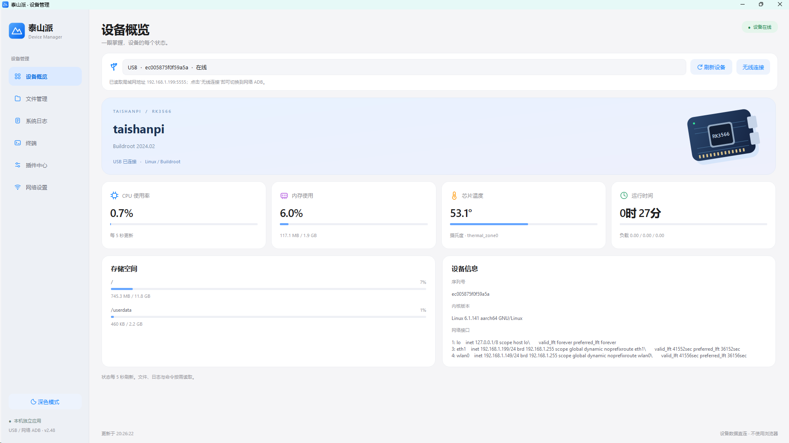
</p>

<p align="center">
  面向 LCSC TaishanPi RK3566 的 Windows 原生桌面管理工具
</p>

<p align="center">
  🪟 Windows · 🐍 Python · 🎨 PySide6 · 🔌 USB / 网络 ADB
</p>

## ✨ 项目简介

泰山派设备管理是一款基于 PySide6 的 Windows 桌面应用，用于通过 USB ADB 或局域网连接、管理和调试 TaishanPi RK3566 设备。

它把设备概览、文件传输、日志查看、交互终端、网络设置和插件管理整合在一个界面中，并提供网络流量监控、测速、代理、串口、摄像头、LD06 雷达和 GPIO 等工具。

## 🧰 功能一览

| 模块 | 能做什么 |
| --- | --- |
| 🖥️ 设备概览 | 查看设备型号、系统、内核、主机名和网络状态 |
| 📁 文件管理 | 在电脑与泰山派之间浏览、上传和下载文件 |
| 💻 交互终端 | 持续 ADB PTY 会话、多标签、实时输出、复制粘贴和中断命令 |
| 📋 系统日志 | 查看、刷新和导出板端日志，辅助定位启动与服务问题 |
| 🌐 网络设置 | 扫描 Wi-Fi、同步配置、查看网卡与路由，并自动同步局域网 IP |
| 🧩 插件中心 | 管理板端插件，导入可信第三方 ZIP，打开独立页面和状态卡片 |
| 📊 网络流量 | 实时速度、累计流量、趋势图、局域网测速和公网测速 |
| 🔀 网络代理 | 管理 Mihomo ARM64 核心、配置、模式、节点和服务自启 |
| 🛠️ 硬件工具 | 串口助手、GPIO/I²C/SPI/PWM、摄像头和 LD06 雷达插件 |

## 🖼️ 界面预览

### 🧩 插件中心

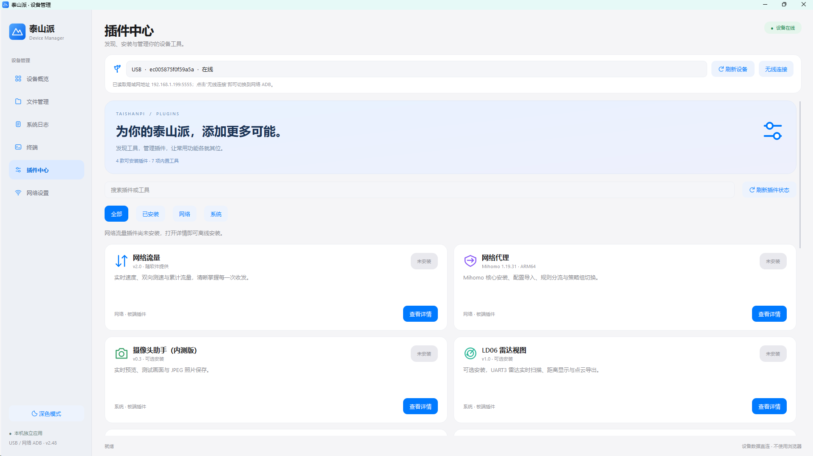

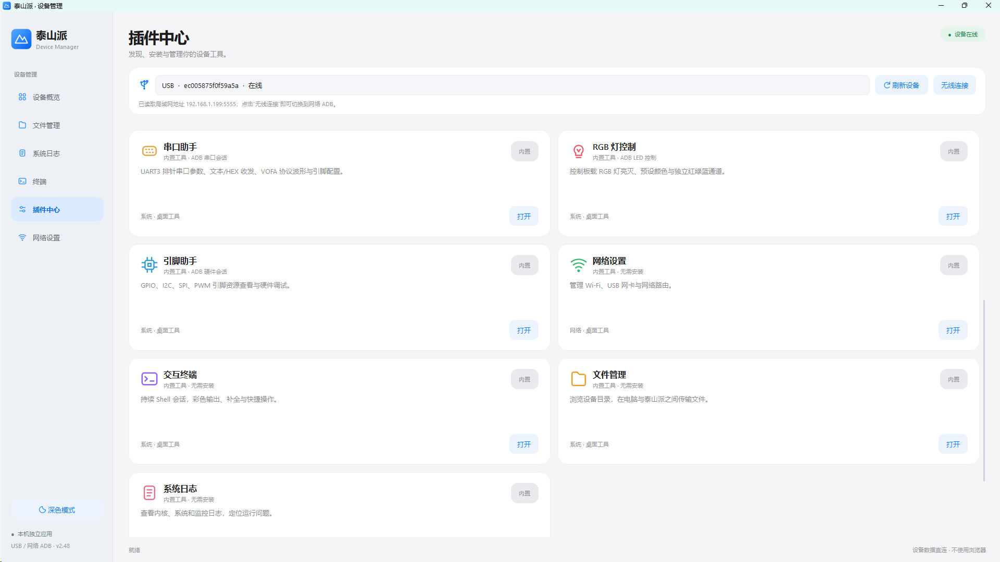

### 🌐 网络与设备管理

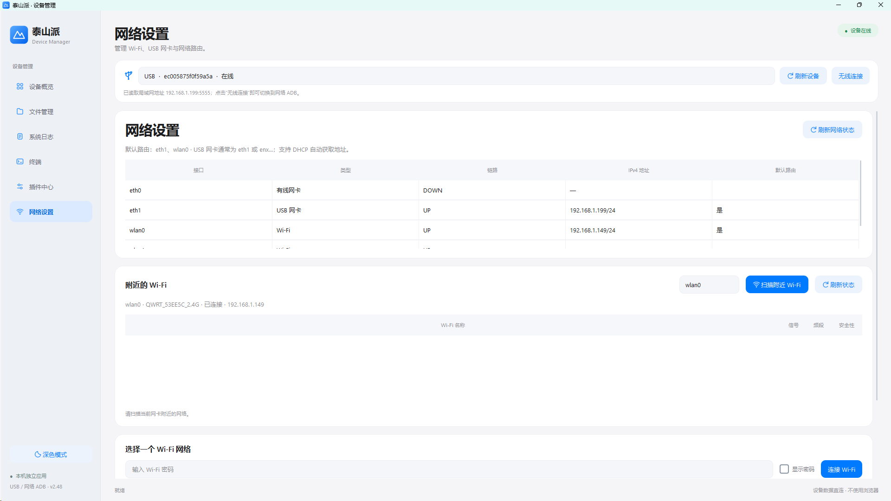

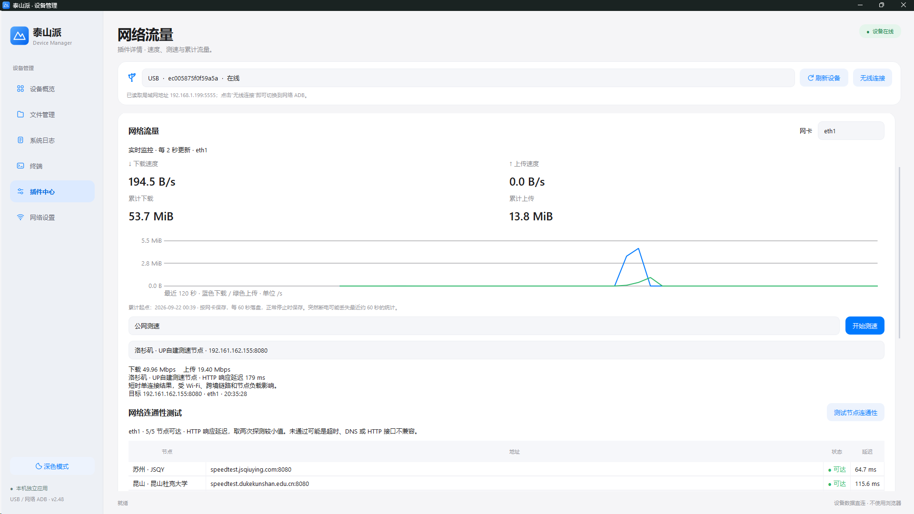

<details>
<summary>📂 展开查看更多：文件管理、系统日志与终端</summary>

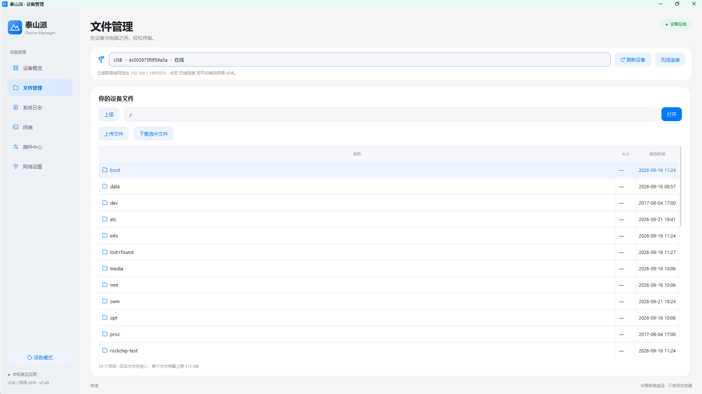

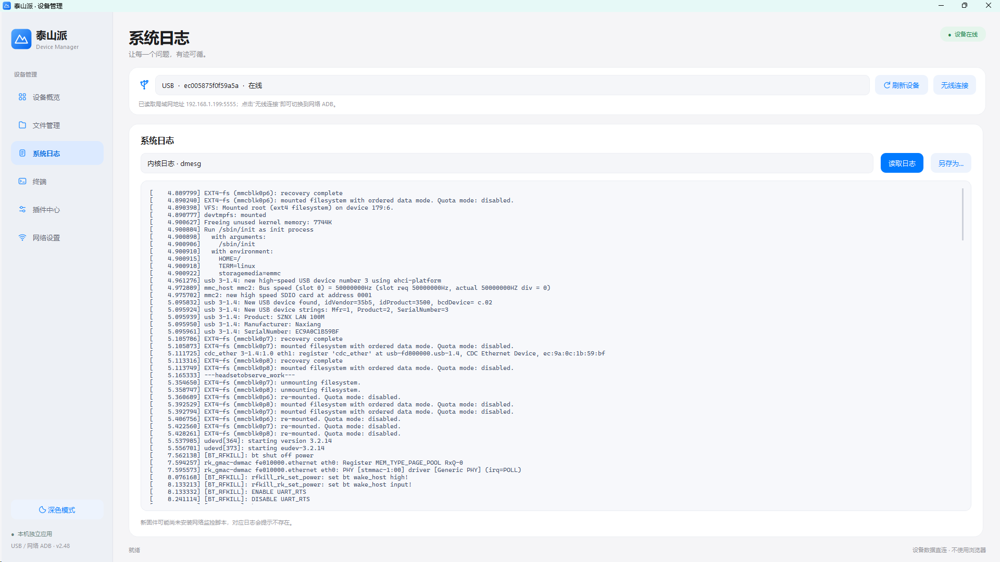

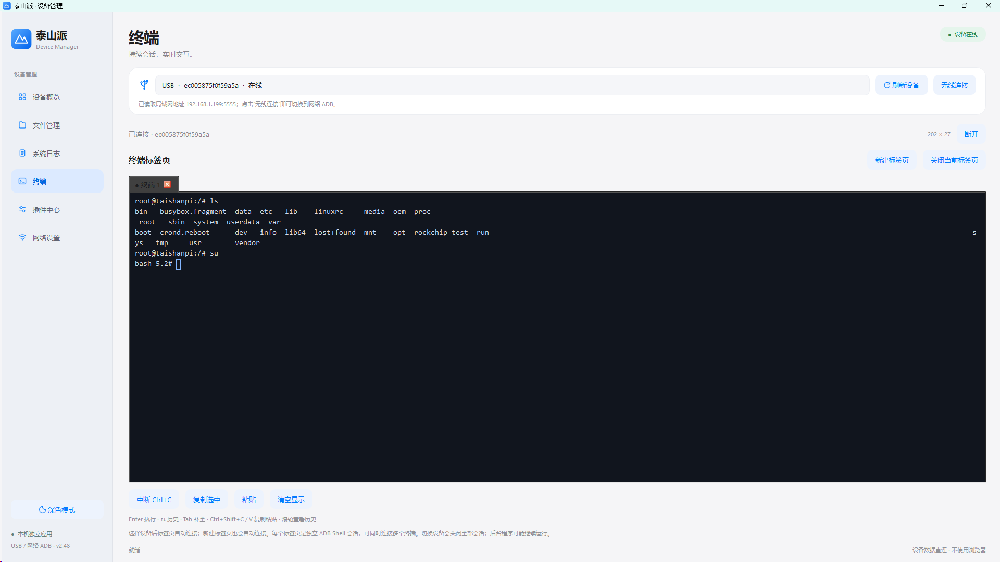

</details>

### 🛠️ 硬件插件

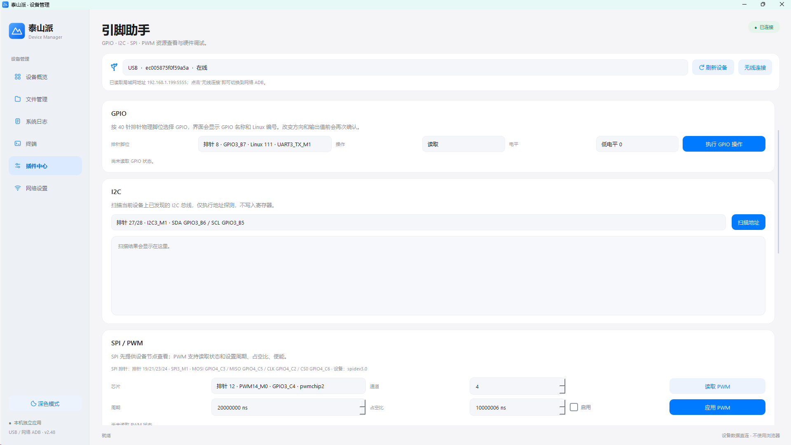

<details>
<summary>🔎 展开查看更多：串口、摄像头、LD06 雷达与 RGB 灯控制</summary>

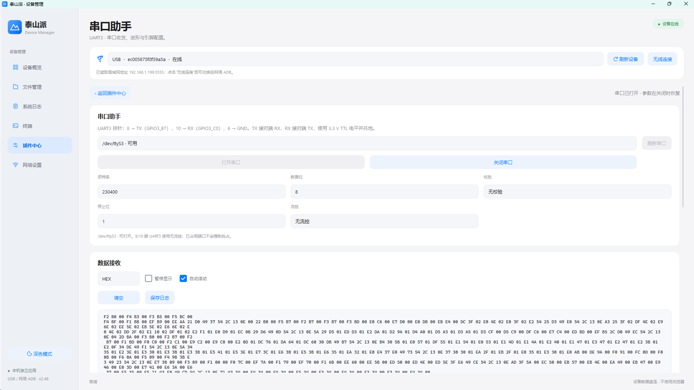

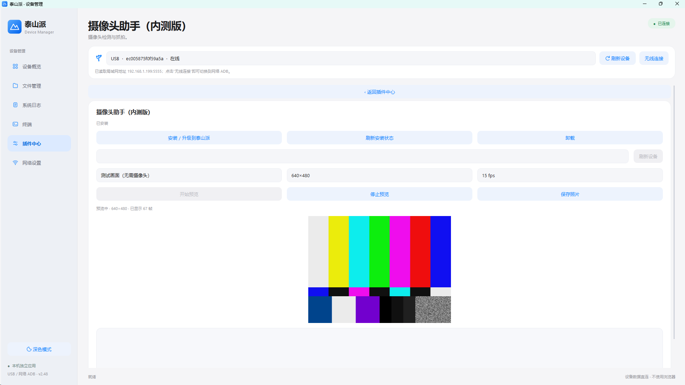

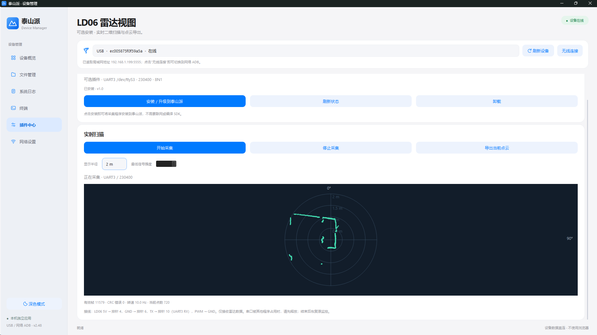

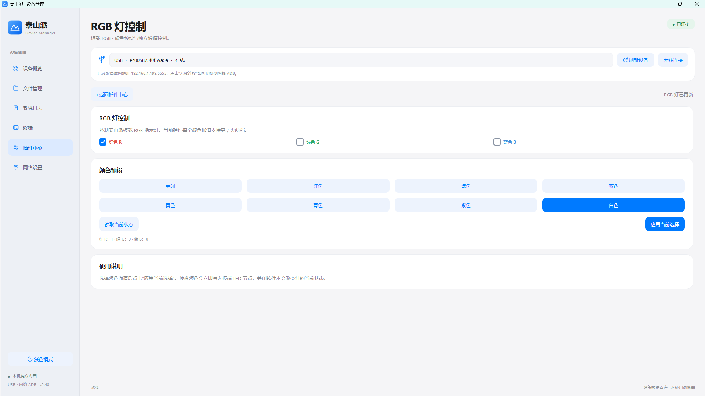

</details>

## 🚀 快速开始

### 📦 直接运行发布版

从 [GitHub Release · v2.62-release](https://github.com/QianmoNai/TaishanPiManager-Desktop/releases/tag/v2.62-release) 下载 `TaishanPiManager-v2.62-Windows-x64.zip`，解压后运行 `TaishanPiManager.exe`。这是便携运行包，无需安装 Python；页面自动生成的 Source code 不是运行包。[Gitee 发行版入口](https://gitee.com/qianmonai/TaishanPiManager-Desktop/releases)可用于查看该平台实际已发布的附件。

请保留 EXE 同目录的 `adb`、`iperf3` 和 `licenses` 文件夹。必要插件资源已内嵌，无需另附 `source` 或 `plugins` 目录。首次使用时，将泰山派通过 USB 连接到电脑并启用 ADB 调试，随后在应用中刷新设备列表。

### 💻 从源码运行

建议使用已验证的 Windows x64、Python 3.13 环境，以及可用的 ADB 工具。以下命令在 PowerShell 中执行；完整重建步骤见[运行与构建](docs/运行与构建.md)。

```powershell
git clone https://gitee.com/qianmonai/TaishanPiManager-Desktop.git
cd TaishanPiManager-Desktop
py -3.13 -m venv .venv
.\.venv\Scripts\python.exe -m pip install PySide6==6.11.2 pyte==0.8.2 wcwidth==0.8.3 PyYAML==6.0.3
.\.venv\Scripts\python.exe source\desktop.py
```

如果电脑上已有 Android SDK Platform Tools，也可以直接使用系统 `adb`。否则请保留项目中的 `adb` 目录，应用会优先查找随项目提供的工具。

### 🔄 检查更新（本地 v2.65：Gitee，尚未发布 Release）

侧栏点击“检查更新”，后台查询 Gitee 最新正式 Release，显示版本和更新说明；点击“打开发布页”后自行下载。无需连接开发板，不上传设备信息，不自动安装。普通 Git 标签不是更新来源；网络失败、限流或仓库不可公开访问时会明确提示，不能视为“已经是最新版”。详见[使用说明](docs/使用说明.md)。

## 💾 烧录教程与固件下载

首次使用泰山派、需要重新烧录系统或恢复设备时，可参考以下资源：

| 资源 | 链接 |
| --- | --- |
| 📖 泰山派烧录教程与下载中心 | [立创开发板 Wiki · TaishanPi RK3566](https://wiki.lckfb.com/zh-hans/tspi-rk3566/download-center.html) |
| ☁️ 泰山派固件发布（百度网盘） | [打开固件分享链接](https://pan.baidu.com/s/5esrmrCqZJGSMTMqvXbYOtA) |
| ⚡ 固件下载（不限速入口） | [download.qianmo.icu](https://download.qianmo.icu/files/) |

⚠️ 下载前请核对板型、固件版本和配套说明，烧录前备份重要数据。具体烧录工具、驱动及操作步骤以教程为准；本项目是设备管理工具，不提供固件烧录功能。实际下载速度取决于网络与服务器情况。

## 🔗 连接方式

- 🔌 USB ADB：适合首次配置、救援和没有网络的设备。
- 🌐 局域网 ADB：适合日常调试和终端操作，默认使用设备的 `5555` 端口。
- 🔄 USB 网卡：可通过 USB 网络连接设备，再由应用读取设备的局域网地址。

⚠️ 应用使用当前 ADB 会话的设备权限执行操作。涉及安装插件、修改网络配置、启动服务和设备重启时，请确认目标设备和操作内容。

## 🗂️ 项目结构

```text
docs/                使用说明、验证记录和项目资料
docs/promo/pictures/ README 展示图片
docs/assets/         历史截图与测试图片
docs/history/        历史使用和验证文档
docs/evidence/       测试数据、校验文件和实测结果
source/              PySide6 桌面端源码与测试
plugins/             随应用分发的板端插件
examples/            第三方插件示例源码
adb/                 Windows ADB 运行文件
iperf3/              局域网测速工具
server-speedtest/    自建公网测速服务示例
licenses/            第三方组件许可证
third-party-source/  第三方源码归档
dist/                构建产物
```

## 🕘 版本历史

项目保留了从 `v1.0` 起的迭代提交历史，当前本地版本基线标签已到 `v2.65`（尚未推送）。查看历史可进入 [Gitee Tags](https://gitee.com/qianmonai/TaishanPiManager-Desktop/tags) 或 [GitHub Tags](https://github.com/QianmoNai/TaishanPiManager-Desktop/tags)；已编写的版本验证记录保存在 [`docs/`](docs/) 中，并非每个标签都有独立验证文档。

当前正式发布版为 **[`v2.62-release`](https://github.com/QianmoNai/TaishanPiManager-Desktop/releases/tag/v2.62-release)**，提供 Windows x64 精简便携包，解压即可运行。近期更新包括第三方 ZIP 插件导入与信任机制、独立页面和状态卡片、后台轮询、与本体一致的浅色/深色 UI，以及卡片淡入和内容变化时的轻量动画。使用方法见[使用说明](docs/使用说明.md)，开发与示例见[第三方插件包开发指南](docs/第三方插件开发.md)。

📌 版本标签沿用“源码改动前保存基线”的约定：旧 `v2.62` 指向动画改动前的代码，**不是本次 Release 的源码标签**；下载或检查当前发布版源码请使用 `v2.62-release`。仅修改文档、图片或示例插件包不创建新的主程序版本标签。

## 📚 文档

- 🧩 [第三方插件包开发指南](docs/第三方插件开发.md)：插件包格式、独立页面、状态卡片、后台任务、板端 Shell 操作和开发示例。
- 📖 [使用说明](docs/使用说明.md)
- 🏗️ [运行与构建](docs/运行与构建.md)
- 🌐 [网络代理使用说明](docs/网络代理使用说明.md)
- 📜 [第三方组件说明](docs/第三方组件说明.md)
- ✅ [验证记录与历史索引](docs/验证记录.md)

## 🧪 开发与验证

运行源码测试：

```powershell
.\.venv\Scripts\python.exe -m unittest discover -s source -p "test_*.py"
```

构建使用 `source/build_desktop.spec`。依赖安装、输出目录、运行文件复制和成品自检步骤见[运行与构建](docs/运行与构建.md)；测试依赖实际环境，完整测试不等于全部硬件已经实机验证。

## 🤝 贡献

欢迎提交 Issue 报告问题或提出功能建议。提交代码时请说明：

1. 使用的泰山派系统版本和连接方式；
2. 是否安装了相关插件；
3. 复现步骤、预期行为和实际行为；
4. 相关日志或截图，以及是否影响 USB ADB 和局域网 ADB。

## ⚖️ 许可证

项目中包含的第三方组件分别遵循其原始许可证，详见 [`licenses/`](licenses/) 和 [第三方组件说明](docs/第三方组件说明.md)。

